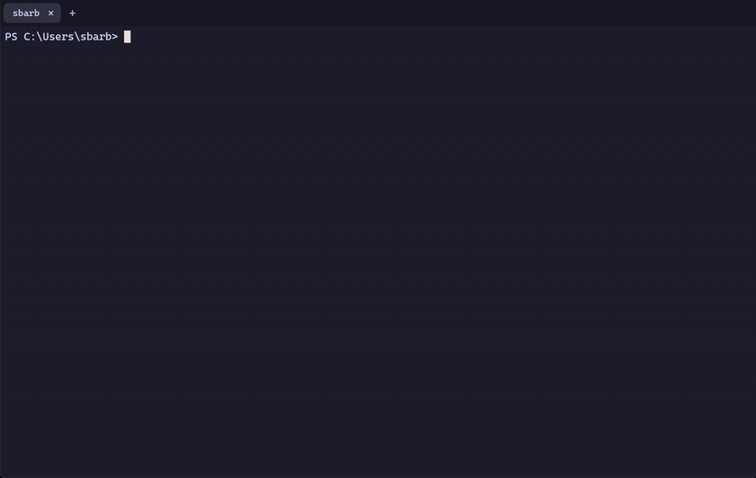
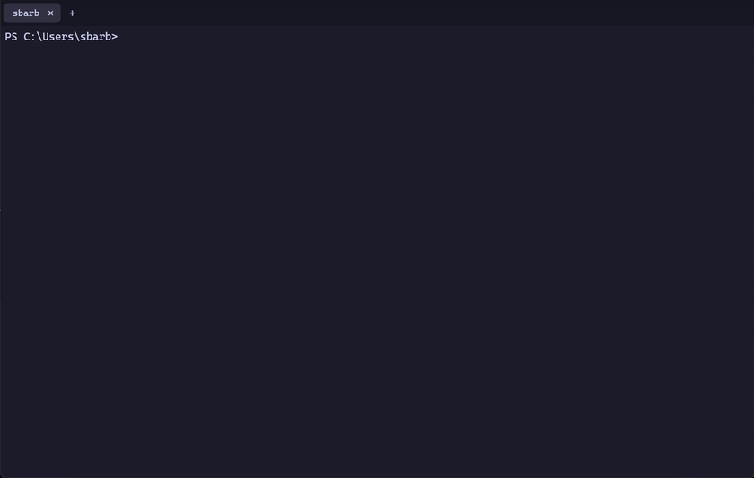
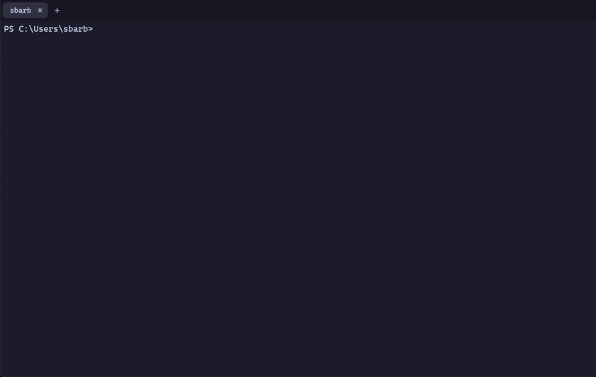
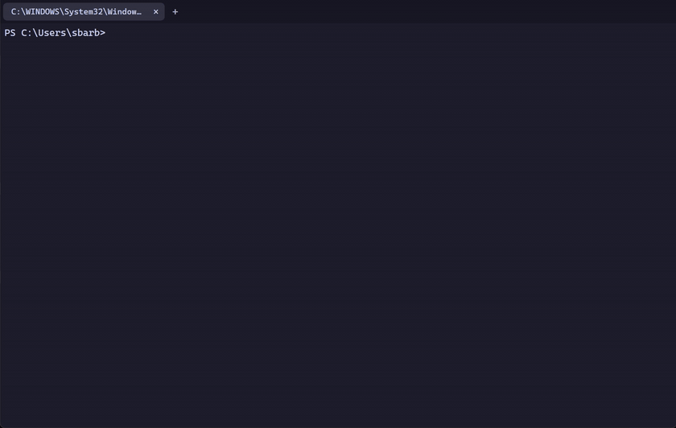

<p align="center">
  
</p>

<h1 align="center">limpet</h1>

<p align="center">
  <b>Full PowerShell + the Linux commands you actually type,<br/>
  with SSH that doesn't drop and a terminal that can show you things.</b>
</p>

<p align="center">
  <code>ls -la</code> · <code>grep</code> · <code>xssh</code> auto-reconnect · <code>peek</code> images inline ·
  <code>download</code>/<code>upload</code> through the session · drag &amp; drop to any server · tabs
</p>

<p align="center"><i>Named after the little mollusc that clings to its rock no matter
how hard the waves hit — which is the whole <code>xssh</code> pitch. Type
<code>limpet</code> in the shell to meet the mascot.</i></p>

---

## Linux muscle memory, PowerShell underneath

Type the Unix commands your hands already know — `ls -la`, `rm -rf`, `cp -r`,
`grep -i`, `head`, `tail -f`, `find`, `du` … — and limpet translates the flags to
native PowerShell cmdlets. It's still real PowerShell: pipelines, objects, and
every cmdlet keep working.

<p align="center"></p>

Full command list: [`docs/COMMANDS.md`](docs/COMMANDS.md)

## Tabs

Multiple shells in one window, like Windows Terminal: `Ctrl+Shift+T` opens a
tab, `Ctrl+Tab` cycles, `Ctrl+Shift+W` (or `exit`, or middle-click) closes one.
Each tab is its own ConPTY session — an `xssh` reconnecting in one tab never
touches the build running in another. Tab titles follow the shell's current
folder.

<p align="center"></p>

## `xssh` — SSH that refuses to die

A drop-in for `ssh` that auto-reconnects with your key when the link drops —
bad hotel Wi-Fi, sleeping laptop, flaky VPN. No password re-typing, no dead
terminal. Pair it with remote `tmux` and your programs survive too.

<p align="center"></p>

```powershell
xssh user@host                                              # use it exactly like ssh
xssh user@host -t "tmux attach -t main || tmux new -s main" # survive drops with state
```

The reconnect is fully client-side — nothing to install on the server.

## `peek` — see images without leaving the terminal

`peek <file>` renders the image inline, scrolls away like text, and never
breaks your prompt. It works at the local prompt **and inside an `xssh`
session** — the remote just needs `base64`.

<p align="center"></p>

## `download` — remote file ➜ PC Downloads, one word

Inside any `xssh` session you get `peek`, `download`, and `upload` — no agent,
no rsync, nothing persisted on the server (the integration is injected fresh
each connect). `download file` drops it straight into your PC's Downloads
folder, through the same connection you're typing over.

<p align="center"></p>

## Drag &amp; drop — files land where your prompt is

Drop a file onto the limpet window while you're in an SSH session and it's
"pasted" into the remote's current directory — reconstructed over the wire via
`base64`, so it works on any box with coreutils. Folders and big files are
better served by `wput <files>`, a client-side `scp` that defaults to your last
`xssh` host.

<p align="center"></p>

## Windows Hello for SSH

Type a host's password **once**:

```powershell
Enable-LimpetHello user@host
```

limpet installs a dedicated key whose passphrase is sealed by the TPM behind
Windows Hello. From then on, `xssh user@host` is just a face/fingerprint/PIN
prompt — reconnects included, no password ever again.

## …and `reels`

Because sometimes the build takes a while: `reels` docks a vertical feed
(default: Instagram Reels, or any URL you pass) on the right side of the
terminal. `reels` again to dismiss.

## Install

```powershell
git clone https://github.com/samuelwbarber/limpet
cd limpet
.\install.ps1          # wires the module into your PowerShell profile

cd app                 # the limpet terminal app (peek/download/drop live here)
npm install
npm start              # or launch "limpet" from the Start Menu after install.ps1
```

- The **shell module** (`shell/`) works in any terminal — Windows Terminal,
  WezTerm, VS Code. `install.ps1` adds it to your profile and creates a Start
  Menu entry for the app.
- The **limpet app** (`app/`) is the tabbed Electron terminal that renders
  inline images and catches `download`/`upload`/drag-drop.
- SSH keys: `.\setup-ssh.ps1` generates a key, loads `ssh-agent`, and can
  install it on a host (`-RemoteHost user@host`).

## How it fits together

| Layer | Job | What provides it |
|-------|-----|------------------|
| Terminal | tabs, rendering, inline images, drop target | **limpet app** (`app/`) or WezTerm (`wezterm/`) |
| Session | survive bad links without re-auth | **`xssh`** (client-side) + optional remote `tmux` |
| Shell | `ls -la`, `grep`, `wput`, `peek`… | **Limpet module** (`shell/`) — the actual code |

In-session `peek`/`download`/`upload` talk to the app over private terminal
escape sequences, so they tunnel through SSH with zero server-side setup.

## Repo layout

```
shell/       Limpet PowerShell module + limpet-remote.sh (in-session helpers) + Hello auth
app/         tabbed Electron terminal (xterm.js + ConPTY)
wezterm/     alternative WezTerm host config
install.ps1  idempotent setup (profile, env, Start Menu shortcut)
setup-ssh.ps1, ssh-resilient.ps1   SSH key + resilient-connection helpers
tests/       Test-Limpet.ps1 smoke test
tools/demo/  scripts that record the README GIFs
docs/        COMMANDS.md reference, demo media
```

## Test

```powershell
.\tests\Test-Limpet.ps1
```
