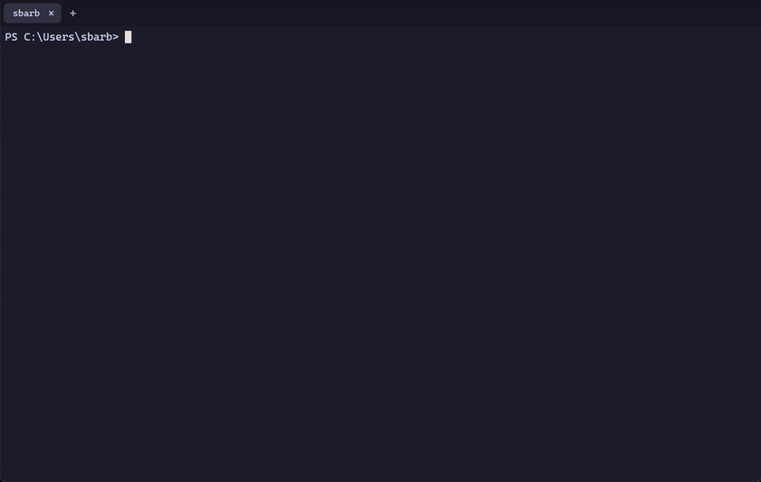
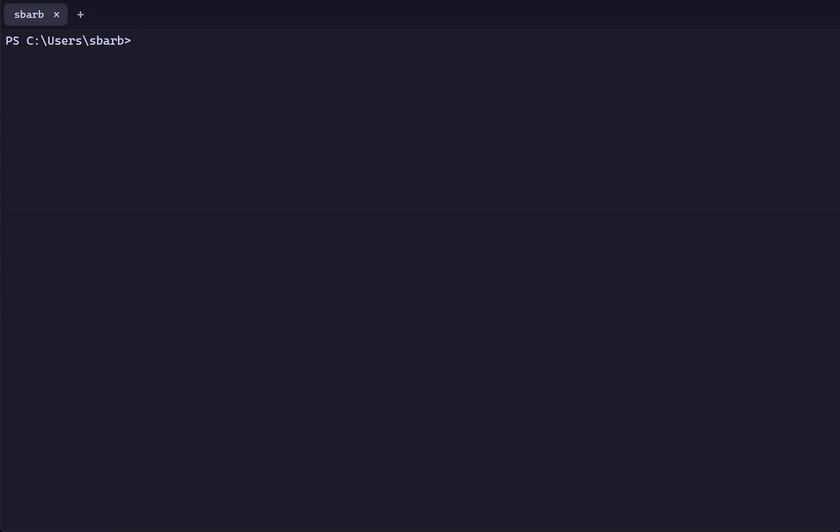
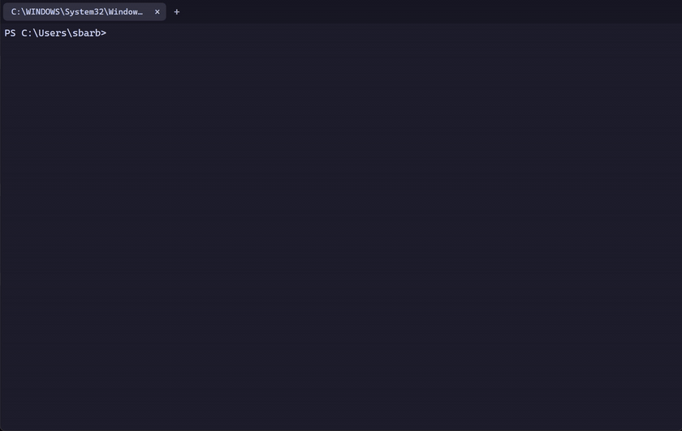
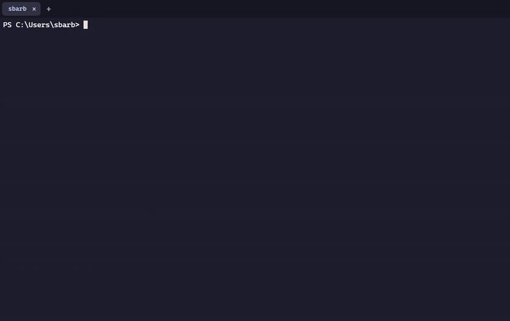
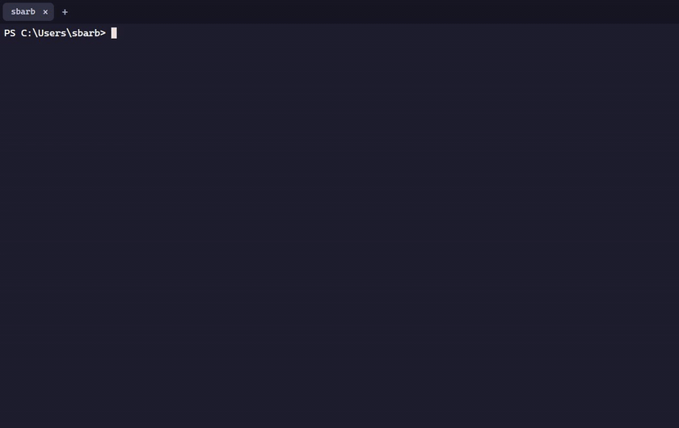

<p align="center">
  
</p>

<h1 align="center">limpet</h1>

<p align="center">
  <b>PowerShell with Linux commands, SSH that reconnects itself,<br/>
  and a terminal that can show images.</b>
</p>

<p align="center"><i>Named after the mollusc that stays stuck to its rock no matter
how hard the waves hit, which is basically what xssh does. Type
<code>limpet</code> in the shell to meet the mascot.</i></p>

---

## Linux muscle memory, PowerShell underneath

Type the Unix commands your hands already know (`ls -la`, `rm -rf`, `cp -r`,
`grep -i`, `head`, `tail`, `find`, `du`) and limpet translates the flags to
the native PowerShell cmdlets. It's still real PowerShell, so pipelines,
objects and every normal cmdlet keep working.

<p align="center"></p>

Full command list: [`docs/COMMANDS.md`](docs/COMMANDS.md)

## xssh

A drop-in for `ssh` that reconnects with your key when the link drops. British train Wi-Fi, a sleeping laptop, a flaky VPN: instead of a dead terminal you
get a short pause and then your session back. Pair it with remote `tmux` and
your programs survive too.

<p align="center"></p>

```powershell
xssh user@host             # use it exactly like ssh
xssh -NoResume user@host   # reconnect to a fresh shell instead of the live one
```

The reconnect is entirely client-side, nothing to install on the server. If
your machine itself goes offline (lid closed, network change), `xssh` waits
for the network to come back and drops you into the exact shell you left,
running processes and scrollback intact. That relies on tmux existing on the
host; without it, or with `-NoResume`, you get a plain fresh shell.

## peek

`peek <file>` renders an image inline in the terminal. It scrolls away like
text and doesn't break your prompt. Works at the local prompt and inside an
`xssh` session, where the remote only needs `base64`.

<p align="center"></p>

## download and upload

Inside any `xssh` session you also get `download` and `upload`. `download
file` sends the file to your PC's Downloads folder through the connection
you're already typing over; `download folder` sends a whole folder (streamed
as a tar and unpacked on arrival). It streams in chunks, so a big file or a
10 GB folder goes through fine without holding anything whole in memory.
There's no agent and no rsync, and nothing is left on the server; the helpers
are injected fresh on each connect.

They only exist in `xssh` sessions, plain `ssh` won't have them. They survive
`tmux`, nested `bash` and `srun`. To reach a second machine (say login node to
compute node), hop with `xssh next-host` instead of `ssh next-host` and they
come along.

<p align="center"></p>

## Drag and drop

Drop a file onto the limpet window while you're in an SSH session and it lands
in the remote's current directory, reconstructed over the wire via `base64`,
so it works on any box with coreutils. For folders and big files use
`wput <files>`, a client-side `scp` that defaults to your last `xssh` host.

<p align="center"></p>

## Windows Hello for SSH

Type a host's password once:

```powershell
Enable-LimpetHello user@host
```

limpet installs a dedicated key whose passphrase is sealed by the TPM behind
Windows Hello. From then on `xssh user@host` is a face, fingerprint or PIN
prompt, reconnects included. No password again.

## reels

Because sometimes the build takes a while. `reels` docks a vertical feed
(Instagram Reels by default, or any URL you pass) on the right side of the
terminal. `reels` again to dismiss.

## Backgrounds

Right-click a tab and pick a background: the standard limpet colour (the
default), a handful of other dark colours, or **Generative**, which paints each
tab with a small pixel-art scene of whatever that tab is working on. The scene
is made by a local image model, so nothing about your terminal leaves the
machine; it updates as the conversation moves on.

<p align="center"></p>

## Three Claude accounts, one history

Keep a personal and a work [Claude Code](https://www.claude.com/product/claude-code)
account signed in alongside your usual one, and share your session history
across all three.

```powershell
claude         # your usual account (config in ~/.claude)
claude1        # personal account
claude2        # work account
```

`claude1` and `claude2` run Claude against their own config directory
(`~/.claude-1`, `~/.claude-2`), so they hold separate logins — `/login` once in
each and both stay authenticated; `claude1` is always personal, `claude2` always
work. Plain `claude` keeps its own login in `~/.claude`.

All three accounts' session transcripts live in one shared store (limpet
junctions each config's `projects/` folder to `~/.claude-shared/projects`), so
**`/resume` lists the same conversations whichever account you're in**. Start
something on your personal account, pick it up on work, and back again.
Transcripts are named by a unique id, so the accounts can run side by side
without ever colliding. The wiring is created automatically the first time you
run `claude1` or `claude2` (or by hand with `Sync-LimpetClaudeHistory`): any
pre-existing `projects/` folder, plain `claude`'s included, is folded into the
shared store file by file, never overwritten. A folder that a running session
still has open is left alone and picked up on the next launch.

Only the transcripts are shared. The up-arrow prompt history stays per account,
because Claude Code refuses to read that file through a link.

Any arguments pass straight through (`claude1 --resume`, `claude2 -p "..."`).
To rename them or add another, copy the `claude1`/`claude2` functions in
`shell/Limpet.psm1`, point them at a different config directory, and add that
directory to `$script:LimpetClaudeConfigDirs` so it joins the shared store.

### Switch account, or agent, mid-chat

In the limpet app, right-click a tab to see the three Claude accounts and
Codex, with the one that tab's chat is running on marked. Pick another and
limpet exits the running agent and brings the same conversation up under the
pick, in the same shell:

- **Claude to Claude**: `<account> --resume <session id>`. Nothing is copied;
  the transcript is shared.
- **Claude to Codex**: Codex's own importer turns the transcript into a Codex
  thread, then `codex resume <thread id>`.
- **Codex to Claude**: limpet writes the chat out as a Claude transcript and
  resumes it, so Claude remembers it natively.
- If a conversion fails, the chat is rendered to a Markdown handoff file and
  the new agent starts with a one-line "continue from here" prompt pointing at
  it.

<p align="center"></p>

Handy when one subscription hits its limit. With nothing running in the tab,
picking an account just starts it there. Moving to Codex sends the conversation
to OpenAI once Codex replies, so pick with that in mind.

## Install

```powershell
git clone https://github.com/samuelwbarber/limpet
cd limpet
.\install.ps1          # wires the module into your PowerShell profile

cd app                 # the limpet terminal app (peek/download/drop live here)
npm install
npm start              # or launch "limpet" from the Start Menu after install.ps1
```

- The shell module (`shell/`) works in any terminal: Windows Terminal,
  WezTerm, VS Code. `install.ps1` adds it to your profile and creates a Start
  Menu entry for the app.
- The limpet app (`app/`) is the tabbed Electron terminal that renders inline
  images and catches `download`, `upload` and drag and drop.
- SSH keys: `.\setup-ssh.ps1` generates a key, loads `ssh-agent`, and can
  install it on a host (`-RemoteHost user@host`).

## How it fits together

| Layer | Job | What provides it |
|-------|-----|------------------|
| Terminal | tabs, rendering, inline images, drop target | limpet app (`app/`) |
| Session | survive bad links without re-auth | `xssh` (client-side) plus optional remote `tmux` |
| Shell | `ls -la`, `grep`, `wput`, `peek` | Limpet module (`shell/`) |

In-session `peek`, `download` and `upload` talk to the app over private
terminal escape sequences, so they tunnel through SSH with no server-side
setup.

## Repo layout

```
shell/       Limpet PowerShell module + limpet-remote.sh (in-session helpers) + Hello auth
app/         tabbed Electron terminal (xterm.js + ConPTY)
install.ps1  idempotent setup (profile, Start Menu shortcut)
setup-ssh.ps1  SSH key setup helper
tests/       Test-Limpet.ps1 smoke test
tools/demo/  scripts that record the README GIFs
docs/        COMMANDS.md reference, demo media
```

## Test

CI runs all of these on every push (see `.github/workflows/ci.yml`):

```powershell
.\tests\Test-Limpet.ps1    # every shell command + peek/reels protocol + Hello helpers
.\tests\Test-Xssh.ps1      # xssh bootstrap variants + reconnect policy (ssh stubbed)
bash tests/test-remote-sh.sh   # remote helpers + the real xssh bootstrap templates (Linux/WSL)

cd app
npm test                   # terminal-protocol + account-switch unit tests (node --test)
npm run test:e2e           # launches the real app: peek, resize survival, reels, download, tab detach, account switch
```
