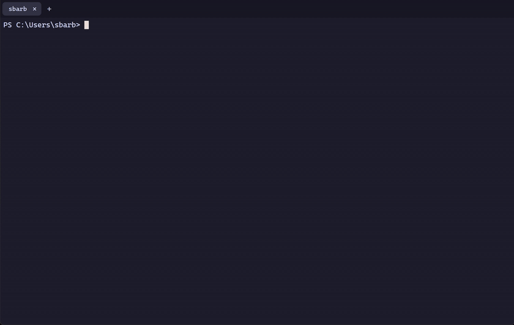
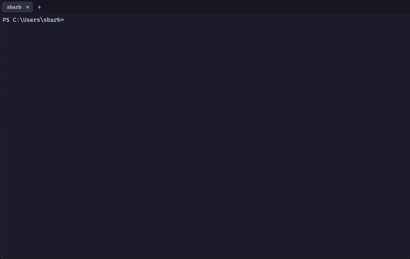
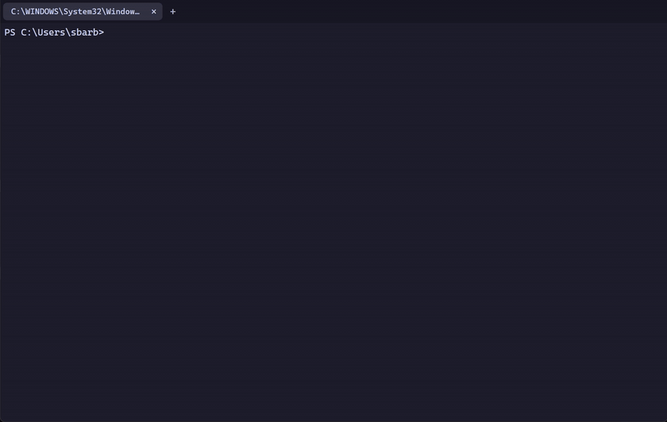
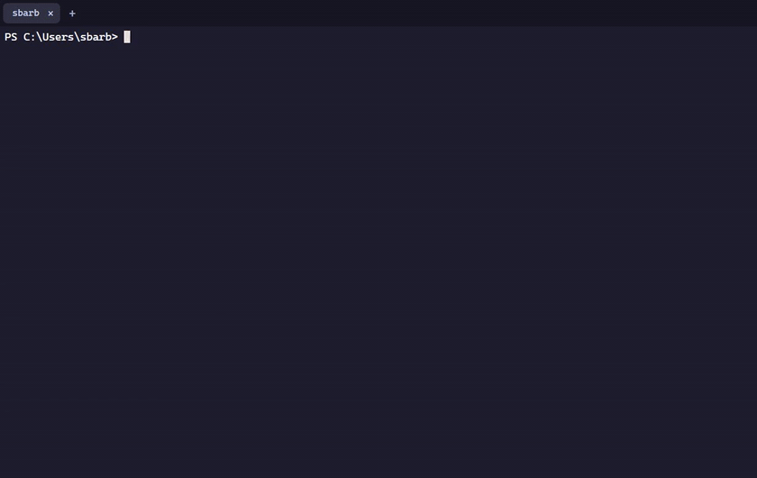
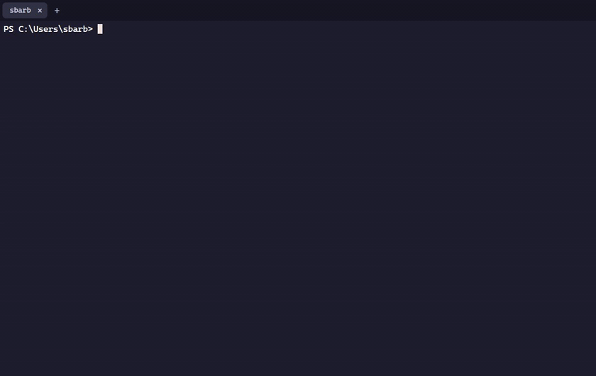

<p align="center">
  
</p>

<h1 align="center">limpet</h1>

<p align="center">
  <b>PowerShell with Linux commands, SSH that reconnects itself,<br/>
  and a terminal that can show images.</b>
</p>

<p align="center"><i>Named after the mollusc that stays stuck to its rock no matter
how hard the waves hit, which is basically what xssh does. Type
<code>limpet</code> in the shell to meet the mascot.</i></p>

---

## Linux muscle memory, PowerShell underneath

Type the Unix commands your hands already know (`ls -la`, `rm -rf`, `cp -r`,
`grep -i`, `head`, `tail`, `find`, `du`) and limpet translates the flags to
the native PowerShell cmdlets. It's still real PowerShell, so pipelines,
objects and every normal cmdlet keep working.

<p align="center"></p>

Full command list: [`docs/COMMANDS.md`](docs/COMMANDS.md)

## xssh

A drop-in for `ssh` that reconnects with your key when the link drops. British train Wi-Fi, a sleeping laptop, a flaky VPN: instead of a dead terminal you
get a short pause and then your session back. Pair it with remote `tmux` and
your programs survive too.

<p align="center"></p>

```powershell
xssh user@host             # use it exactly like ssh
xssh -NoResume user@host   # reconnect to a fresh shell instead of the live one
```

The reconnect is entirely client-side, nothing to install on the server. If
your machine itself goes offline (lid closed, network change), `xssh` waits
for the network to come back and drops you into the exact shell you left,
running processes and scrollback intact. That relies on tmux existing on the
host; without it, or with `-NoResume`, you get a plain fresh shell.

## peek

`peek <file>` renders an image inline in the terminal. It scrolls away like
text and doesn't break your prompt. Works at the local prompt and inside an
`xssh` session, where the remote only needs `base64`.

<p align="center"></p>

## download and upload

Inside any `xssh` session you also get `download` and `upload`. `download
file` sends the file to your PC's Downloads folder through the connection
you're already typing over; `download folder` sends a whole folder (streamed
as a tar and unpacked on arrival). It streams in chunks, so a big file or a
10 GB folder goes through fine without holding anything whole in memory.
There's no agent and no rsync, and nothing is left on the server; the helpers
are injected fresh on each connect.

They only exist in `xssh` sessions, plain `ssh` won't have them. They survive
`tmux`, nested `bash` and `srun`. To reach a second machine (say login node to
compute node), hop with `xssh next-host` instead of `ssh next-host` and they
come along.

<p align="center"></p>

## Drag and drop

Drop a file onto the limpet window while you're in an SSH session and it lands
in the remote's current directory, reconstructed over the wire via `base64`,
so it works on any box with coreutils. For folders and big files use
`wput <files>`, a client-side `scp` that defaults to your last `xssh` host.

<p align="center"></p>

## Windows Hello for SSH

Type a host's password once:

```powershell
Enable-LimpetHello user@host
```

limpet installs a dedicated key whose passphrase is sealed by the TPM behind
Windows Hello. From then on `xssh user@host` is a face, fingerprint or PIN
prompt, reconnects included. No password again.

## reels

Because sometimes the build takes a while. `reels` docks a vertical feed
(Instagram Reels by default, or any URL you pass) on the right side of the
terminal. `reels` again to dismiss.

## Backgrounds

Right-click a tab and pick a background: the standard limpet colour (the
default), a handful of other dark colours, or **Generative**, which paints each
tab with a small pixel-art scene of whatever that tab is working on. The scene
is made by a local image model, so nothing about your terminal leaves the
machine; it updates as the conversation moves on. The first time you pick
Generative, limpet offers to download that model (about 675 MB, once) and shows
the progress; `npm run setup:backdrop` in `app/` does the same from a prompt.

<p align="center"></p>

## Any number of Claude, Codex, Antigravity and Copilot accounts

Keep as many [Claude Code](https://www.claude.com/product/claude-code),
[Codex](https://github.com/openai/codex), Antigravity (`agy`) and
[GitHub Copilot CLI](https://github.com/github/copilot-cli) logins as you have
subscriptions, each behind its own command, and share each agent's session
history across all of its accounts.

```powershell
claude         # your usual account       (config in ~/.claude)
claude1        # another Claude login     (~/.claude-1)
claude2        # and another              (~/.claude-2)
claude7        # any number works         (~/.claude-7, created on first run)
codex          # your usual Codex         (~/.codex)
codex1         # another Codex login      (~/.codex-1)
agy1           # another Antigravity login (kept in ~/.agy-1)
copilot1       # another Copilot login    (~/.copilot-1)
```

`claudeN` runs Claude Code with `CLAUDE_CONFIG_DIR` pointed at `~/.claude-N`;
`codexN` runs Codex with `CODEX_HOME` at `~/.codex-N`; `copilotN` runs Copilot
with `COPILOT_HOME` at `~/.copilot-N`. Each holds a separate login: `/login`
once in each and it stays signed in. There is no list to edit.

Antigravity has no such setting: `agy` keeps a single login in Windows
Credential Manager. So limpet keeps each `agyN` account's login in `~/.agy-N`
(encrypted for your Windows user) and swaps it in for the length of the
launch, setting plain `agy`'s own login aside in `~/.agy` and putting it back
when `agyN` exits. Sign in once inside `agy1` and it stays signed in. Because
Credential Manager holds one login at a time, a second `agy` account is refused
while one is running (the same account in two tabs is fine), and plain `agy`
goes through limpet too, so it always gets its own login back. If a tab is
closed while `agyN` runs, plain `agy`'s login is put back the next time a tab
opens or `agy` starts. Every `agy` account already shares one chat history,
since agy keeps all of it in `~/.gemini`.
Type a number that doesn't exist yet and limpet creates the directory and runs
the agent there (a numbered command whose directory already exists is a real
function, so it tab-completes). Any arguments pass straight through
(`claude3 --resume`, `codex2 resume <id>`, `claude1 -p "..."`).

All Claude accounts' session transcripts live in one shared store (limpet
junctions each config's `projects/` folder to `~/.claude-shared/projects`), so
**`/resume` lists the same conversations whichever account you're in**. Start
something on one account, pick it up on another, and back again. Transcripts
are named by a unique id, so the accounts can run side by side without ever
colliding. The wiring is created automatically whenever a numbered `claude`
command runs (or by hand with `Sync-LimpetClaudeHistory`): any pre-existing
`projects/` folder, plain `claude`'s included, is folded into the shared store
file by file, never overwritten. A folder that a running session still has
open is left alone and picked up on the next launch.

Only the transcripts are shared. The up-arrow prompt history stays per account,
because Claude Code refuses to read that file through a link.

Codex accounts share plain `codex`'s history the same way: every `~/.codex-N`
gets its `sessions/`, `archived_sessions/` and `thread-writer-locks/` junctioned
to `~/.codex`'s, its `session_index.jsonl` (the thread names) hard-linked to
`~/.codex`'s, and `sqlite_home` in its `config.toml` pointed at `~/.codex`
(Codex's thread index, which `/resume` lists from), so `/resume` in `codex1`
lists the same threads, names included, as plain `codex`. Sharing the writer
locks keeps Codex's own guard working across accounts: a thread that is open
in one account can't be opened for writing in another at the same time.
`~/.codex` stays where it is (the Codex app and editor extensions keep using it
directly); a numbered home's own threads are folded into it on the first sync
and indexed there, and a thread copied to another account and continued there
keeps the longer copy. The wiring happens whenever a numbered `codex` command
runs (or by hand with `Sync-LimpetCodexHistory`); a home with a chat open is
left until a later launch. Logins, the rest of the config and the up-arrow
history stay per account.

Copilot accounts share plain `copilot`'s the same way: each `~/.copilot-N` gets
its `session-state/` (one folder per chat, which Copilot's resume list is built
from) junctioned to `~/.copilot`'s.

### Switch account, or agent, mid-chat

In the limpet app, right-click a tab to see every account that is signed in,
of every agent, Claude and Codex ones with how much of their 5-hour and weekly
limit is left (`5h 88% · wk 70%`, hover for the reset times; green, amber and
red as it runs out; agy and Copilot show `usage n/a`). The account the tab's
chat is running on is marked. Accounts that aren't signed in are left out, and
the footer names the commands to run to add one (`Sign in to more: claude3,
codex1`). An `agy` account counts once its login is kept (plain `agy` once agy
has been used) and a Copilot one once Copilot has run in its home, since both
keep their tokens where limpet can't look. Pick another and limpet exits the
running agent and brings the same conversation up under the pick, in the same
shell:

- **Between accounts of one agent**: the same chat, resumed by id
  (`claude1 --resume`, `codex2 resume`, `agy1 --conversation`,
  `copilot2 --resume`). Nothing is copied; the history is shared (into a Codex
  home that isn't wired up yet, the rollout file is copied first).
- **Claude to Codex**: Codex's own importer turns the transcript into a thread
  in that Codex account, then `<account> resume <thread id>`.
- **Anything to Claude**: limpet writes the chat out as a Claude transcript and
  resumes it, so Claude remembers it natively.
- **Anything else** (to agy or Copilot, or from them to Codex), or a
  conversion that fails: the chat is rendered to a Markdown handoff file and
  the new agent starts with a one-line "continue from here" prompt pointing at
  it.

<p align="center"></p>

Handy when one subscription hits its limit: the usage column shows which one
still has room. With nothing running in the tab, picking an account just
starts it there. Moving to Codex sends the conversation to OpenAI once Codex
replies, so pick with that in mind. Usage is read with each account's own
stored login, from the same endpoints `/usage` (Claude) and `/status` (Codex)
use, and nothing is written back; an expired login shows `usage n/a` until you
run that account again.

## Install

```powershell
git clone https://github.com/samuelwbarber/limpet
cd limpet
.\install.ps1
```

Then type **limpet** in the Windows search box to open the app.

`install.ps1` adds the shell module to your PowerShell profile, installs the
app (it needs [Node.js](https://nodejs.org): `winget install OpenJS.NodeJS.LTS`)
and adds the Start Menu entry that search finds. Re-running it is safe.

- The shell module (`shell/`) works in any terminal: Windows Terminal,
  WezTerm, VS Code.
- The limpet app (`app/`) is the tabbed Electron terminal that renders inline
  images and catches `download`, `upload` and drag and drop. From a prompt:
  `cd app; npm start`.
- SSH keys: `.\setup-ssh.ps1` generates a key, loads `ssh-agent`, and can
  install it on a host (`-RemoteHost user@host`).

## How it fits together

| Layer | Job | What provides it |
|-------|-----|------------------|
| Terminal | tabs, rendering, inline images, drop target | limpet app (`app/`) |
| Session | survive bad links without re-auth | `xssh` (client-side) plus optional remote `tmux` |
| Shell | `ls -la`, `grep`, `wput`, `peek` | Limpet module (`shell/`) |

In-session `peek`, `download` and `upload` talk to the app over private
terminal escape sequences, so they tunnel through SSH with no server-side
setup.

## Repo layout

```
shell/       Limpet PowerShell module + limpet-remote.sh (in-session helpers) + Hello auth
app/         tabbed Electron terminal (xterm.js + ConPTY)
install.ps1  idempotent setup (profile, app install, Start Menu shortcut)
setup-ssh.ps1  SSH key setup helper
tests/       Test-Limpet.ps1 smoke test
tools/demo/  scripts that record the README GIFs
docs/        COMMANDS.md reference, demo media
```

## Test

CI runs all of these on every push (see `.github/workflows/ci.yml`):

```powershell
.\tests\Test-Limpet.ps1    # every shell command + peek/reels protocol + Hello helpers
.\tests\Test-Xssh.ps1      # xssh bootstrap variants + reconnect policy (ssh stubbed)
bash tests/test-remote-sh.sh   # remote helpers + the real xssh bootstrap templates (Linux/WSL)

cd app
npm test                   # terminal-protocol + account-switch unit tests (node --test)
npm run test:e2e           # launches the real app: peek, resize survival, reels, download, tab detach, account switch
```
